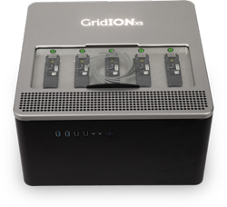
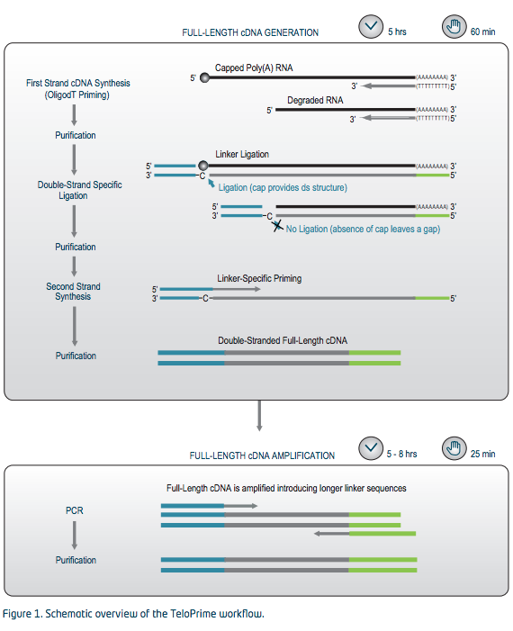

# GridION_yeast_cDNA-seq

Produce full-length cDNA reads from a common yeast (S288c) sample and sequence them using a GridION flow-cell. Perform standard QC on the obtained reads and use them to perform a transcriptome analysis using popular tools. This work aims at evaluating wether ONT transcriptome data is sufficient (quantity and quality) to perform transcript analysis and potentially differential expression analysis.

# Sample and library

## Sample prep & RNA QC

TBD

## Library prep & QC

Due to the excessive quantity of input mRNA material required for **'direct RNA sequencing'** (500ng polyA+) we decided to use the **'TeloPrime Full-Length cDNA Amplification Kit V2'** ([link](https://www.lexogen.com/wp-content/uploads/2018/12/013UG022V0200_TeloPrime-V2.pdf)) starting from total RNA. This kit first creates a reverse strand cDNA primed with an oligo-dT containing custom primer followed by a CAP-specific second strand synthesis and ends by a limited PCR amplification of the obtained 'full-length' cDNA ([full workflow](https://www.lexogen.com/teloprime-workflow/)).

The PCR primers included in all TeloPrime Kits V2 (Cat. No. 013, 018) have the following sequence:
* FP: 5’ – TGGATTGATATGTAATACGACTCACTATAG – 3‘
* RP: 5’ – TCTCAGGCGTTTTTTTTTTTTTTTTTT – 3‘

An estimated amount of 200fmol of the final amplified cDNA (average size 1.5kb from BioAnalyzer) sample was used as input with the ONT **SQK-LSK109** kit anfd 50fmol of resulting library was loaded on a ONT **FloMin106** flow-cell.

# Long read sequencing

This transcriptome experiment was run on a single GridION flow-cell (R9) and the GridION X5 device in order to produce sufficient amounts of data for a comprehensive analysis of gene expression from our yeast sample.

## GridION run & QC

The flow-cell was run and basecalled using the rapid Guppy mode due to an issue with the hac mode in real-time basecalling
The run was terminated after ~42h as it did not produce significant data anymore and the final [run-QC report](GridION_yeast_cDNA-seq/ONT_Run-report.pdf) is attached and shows a good overall quality and decent quantity in specs with a succesful cDNA sequencing run.

The ONT Data-QC pipeline () was applied to the obtained *sequencing_summary.txt*, leading to the following [rapid_report](GridION_yeast_cDNA-seq/Nanopore_SumStatQC_rapid.html).

## Basecalling with Guppy 3.0.6 in hac-mode

In order to obtain highest possible base call qualities, the raw *fast5_pass* data was re-analyzed on the GridION X5 platform using Guppy 3.0.6 and the *hac-mode*. The ONT was run on the hac-basecalled data, leading to the final Data-QC [hac_report](GridION_yeast_cDNA-seq/Nanopore_SumStatQC_hac.html)

# Pinfish analysis
