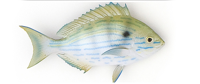

# Pinfish analysis

Analyse the yeast ONT long-reads and discover isoforms.

**Content:** 
* [Pinfish workflow](#pinfish_workflow)  

 
<a name="pinfish_workflow"/>

## Pinfish workflow

The [original Pinfish snakemake + Rmarkdown workflow](https://github.com/nanoporetech/pipeline-pinfish-analysis) was edited and used to produce the following results. The modified files can be accessed [on our fork](https://github.com/Nucleomics-VIB/ont_tutorial_pinfish). Please note that some tools were added to the original code to produce additional figures in teh Rmd report.

